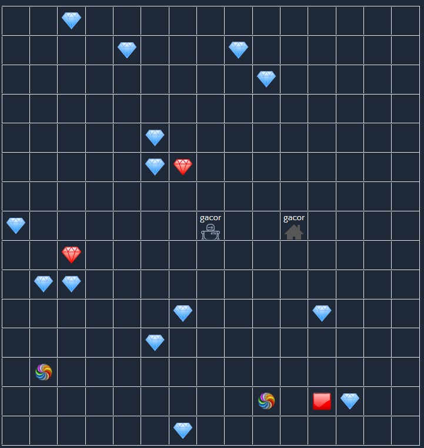

# Diamond Bot Game - GACOR Implementation





## Deskripsi Proyek

Proyek ini merupakan implementasi bot cerdas untuk permainan **Diamonds** menggunakan **algoritma greedy**. Bot GACOR dirancang untuk mengumpulkan diamond secara optimal dengan membuat keputusan terbaik berdasarkan kondisi saat ini tanpa mempertimbangkan strategi jangka panjang.

## Algoritma Greedy yang Diimplementasikan

### Prinsip Dasar Algoritma Greedy

Bot GACOR menggunakan algoritma greedy dengan karakteristik:

- **Pengambilan keputusan lokal optimal**: Selalu memilih target dengan rasio terbaik antara jarak dan nilai poin
- **Tidak ada backtracking**: Keputusan yang sudah diambil tidak dapat diubah
- **Efisiensi waktu**: Eksekusi cepat karena tidak perlu mengevaluasi semua kemungkinan

### Implementasi Spesifik:

#### 1. **Fungsi Prioritas Target**

```python
prioritas = jarak_ke_target / nilai_poin_target
```

Target dengan nilai prioritas **terendah** akan dipilih terlebih dahulu (rasio terkecil = efisiensi tertinggi).

#### 2. **Strategi Pengambilan Keputusan**:

- **Jarak Manhattan**: `|x1-x2| + |y1-y2|` untuk menghitung jarak ke target
- **Optimasi Teleporter**: Mempertimbangkan jalur teleporter jika lebih efisien
- **Sorting Greedy**: Mengurutkan semua target berdasarkan rasio jarak/poin (ascending)
- **Pemilihan Target**: Mengambil target dengan rasio terkecil

#### 3. **Kondisi Khusus (Safety Mechanisms)**:

- **Time Management**: Kembali ke base jika waktu tersisa ≤ (jarak_ke_base + 2)
- **Inventory Management**: Hindari diamond merah (nilai 2) saat inventory = 4
- **Emergency Return**: Langsung pulang jika inventory penuh (5 diamond)
- **Reset Button**: Prioritas khusus untuk tombol reset (nilai 0.75)

#### 4. **Algoritma Utama**:

```
1. Inisialisasi posisi dan target
2. Hitung prioritas semua diamond menggunakan rasio jarak/poin
3. Sort target berdasarkan prioritas (greedy selection)
4. Pilih target dengan prioritas tertinggi
5. Tentukan arah gerakan menuju target
6. Return delta_x, delta_y
```

### Keunggulan Algoritma:

- ✅ Eksekusi sangat cepat (O(n log n) untuk sorting)
- ✅ Memory efficient (tidak menyimpan path kompleks)
- ✅ Cocok untuk real-time gaming
- ✅ Mudah di-debug dan dipahami

### Keterbatasan:

- ❌ Tidak selalu optimal secara global
- ❌ Rentan terhadap local optimum
- ❌ Tidak mempertimbangkan pergerakan bot lain

## Requirements dan Instalasi

### System Requirements

#### Untuk Game Engine:

- **Node.js** (https://nodejs.org/en)
- **Docker Desktop** (https://www.docker.com/products/docker-desktop/)
- **Yarn**: `npm install --global yarn`

#### Untuk Bot:

- **Python 3.7+** (https://www.python.org/downloads/)
- **Dependencies**: `colorama`, `requests` (sudah termasuk dalam requirements.txt)

### Instalasi Game Engine

1. **Download dan Extract Game Engine**

   ```bash
   # Download dari release: tubes1-IF2110-game-engine-1.1.0.zip
   # Extract dan masuk ke folder
   cd tubes1-IF2110-game-engine-1.1.0
   ```
2. **Install Dependencies**

   ```bash
   yarn
   ```
3. **Setup Environment Variables**

   **Windows:**

   ```bash
   ./scripts/copy-env.bat
   ```

   **Linux/macOS:**

   ```bash
   chmod +x ./scripts/copy-env.sh
   ./scripts/copy-env.sh
   ```
4. **Setup Database** (pastikan Docker Desktop sudah running)

   ```bash
   docker compose up -d database
   ```

   **Windows:**

   ```bash
   ./scripts/setup-db-prisma.bat
   ```

   **Linux/macOS:**

   ```bash
   chmod +x ./scripts/setup-db-prisma.sh
   ./scripts/setup-db-prisma.sh
   ```
5. **Build dan Run Game Engine**

   ```bash
   npm run build
   npm run start
   ```

   Game engine akan berjalan di: **http://localhost:8082/**

### Instalasi Bot

1. **Download dan Extract Bot Starter Pack**

   ```bash
   # Download dari release: tubes1-IF2110-bot-starter-pack-1.0.1.zip
   # Extract dan masuk ke folder
   cd tubes1-IF2110-bot-starter-pack-1.0.1
   ```
2. **Install Dependencies**

   ```bash
   pip install -r requirements.txt
   ```
3. **Setup Bot GACOR**

   - Copy file `BOTASA.py` ke folder `game/logic/`
   - Update `main.py` untuk mendaftarkan GACOR di CONTROLLERS (sudah dilakukan)

## Command dan Langkah-langkah Menjalankan Program

### 1. Menjalankan Game Engine

```bash
# Pastikan Docker Desktop sudah running
npm run start
```

### 2. Menjalankan Bot GACOR

#### Registrasi Bot Baru:

```bash
python main.py --logic Gacor --email=gacor1@email.com --name=gacor --password=123456 --team etimo
```

### 3. Menjalankan Multiple Bots

**Windows:**

```bash
./run-bots.bat
```

**Linux/macOS:**

```bash
./run-bots.sh
```

## Struktur Project

```
project/
├── main.py                    # Entry point utama
├── requirements.txt           # Python dependencies
├── run-bots.bat/.sh          # Script untuk multiple bots
├── game/
│   ├── logic/
│   │   ├── GACOR.py         # Implementasi bot greedy
│   │   ├── base.py           # Base class untuk bot
│   │   ├── random.py         # Bot random (contoh)
│   │   └── ...               # Bot logic lainnya
│   ├── api.py                # API communication
│   ├── board_handler.py      # Board management
│   ├── bot_handler.py        # Bot management
│   ├── models.py             # Data models
│   └── util.py               # Utility functions
└── README.md                 # Dokumentasi ini
```

## Cara Kerja Program

### Flow Eksekusi:

1. **Inisialisasi**: Program memuat konfigurasi dan melakukan autentikasi
2. **Board Join**: Bot bergabung ke board permainan yang tersedia
3. **Game Loop**:
   - Analisis kondisi board saat ini
   - Hitung prioritas semua target menggunakan algoritma greedy
   - Tentukan target optimal berdasarkan rasio jarak/poin
   - Eksekusi gerakan menuju target
   - Update state dan ulangi

### Debug Output:

Bot akan menampilkan informasi real-time:

```
bot time remaining: 45000
current position = Position(x=5, y=7)
inventory: 3
Teleporter position: [(Position(x=2, y=3), 0), (Position(x=12, y=8), 0)]
Target position: Position(x=8, y=4)
Elapsed Time: 0.002
```

## Troubleshooting

### Game Engine Issues:

- **"Database connection failed"**: Pastikan Docker Desktop running
- **"Port 8082 already in use"**: Kill process yang menggunakan port tersebut
- **"Build failed"**: Jalankan `yarn` ulang untuk install dependencies

### Bot Issues:

- **"Invalid logic controller"**: Pastikan menggunakan "GACOR" (case-sensitive)
- **"Unable to register bot"**: Periksa koneksi internet dan pastikan email unik
- **"Bot does not exist"**: Periksa token bot atau registrasi ulang
- **"Invalid move"**: Bot mencoba gerakan ilegal, akan diabaikan otomatis

### Performance Issues:

- **Bot lambat**: Gunakan `--time-factor 1` atau kurangi kompleksitas algoritma
- **Memory usage tinggi**: Restart bot jika sudah berjalan lama

## Identitas Pembuat

**Nama**: Ahmat Prayoga Sembiring
**NIM**: 123140053
**Kelas**: RA
**Mata Kuliah**: Strategi Algoritma
**Tahun Akademik**: 2024/2025
**Institusi**: Institut Teknologi Sumatera

**Nama**: **Sigit Kurnia Hartawan**
**NIM**: 123140033
**Kelas**: RA
**Mata Kuliah**: Strategi Algoritma
**Tahun Akademik**: 2024/2025
**Institusi**: Institut Teknologi Sumatera

**Nama**: **Muhammad Fadhillah Akbar**
**NIM**: 123140003
**Kelas**: RA
**Mata Kuliah**: Strategi Algoritma
**Tahun Akademik**: 2024/2025
**Institusi**: Institut Teknologi Sumatera

---
